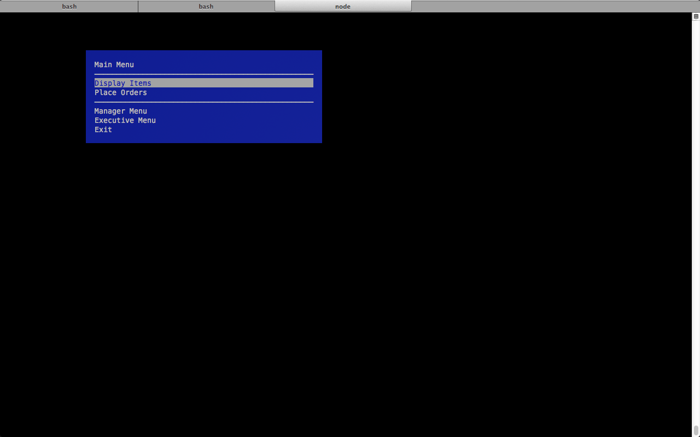
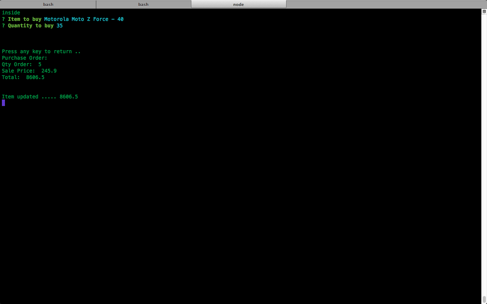
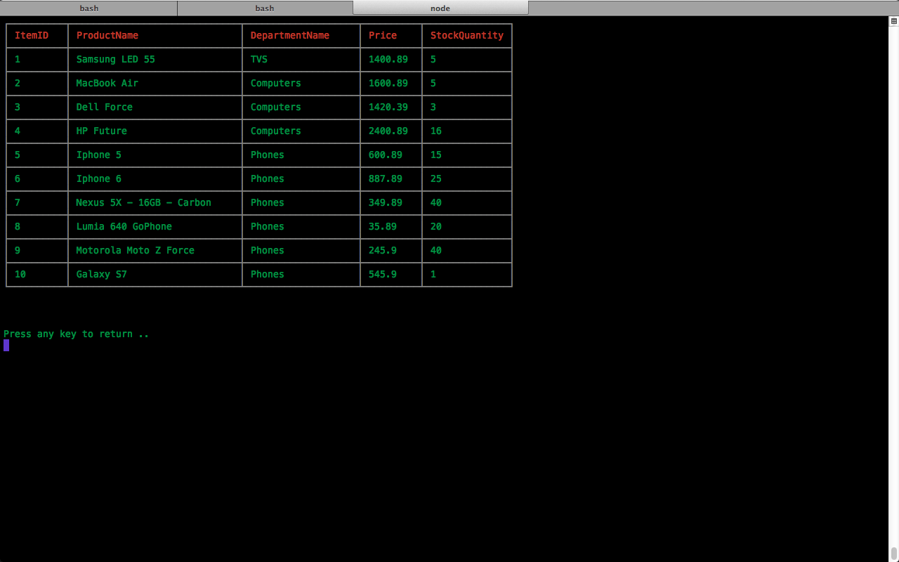
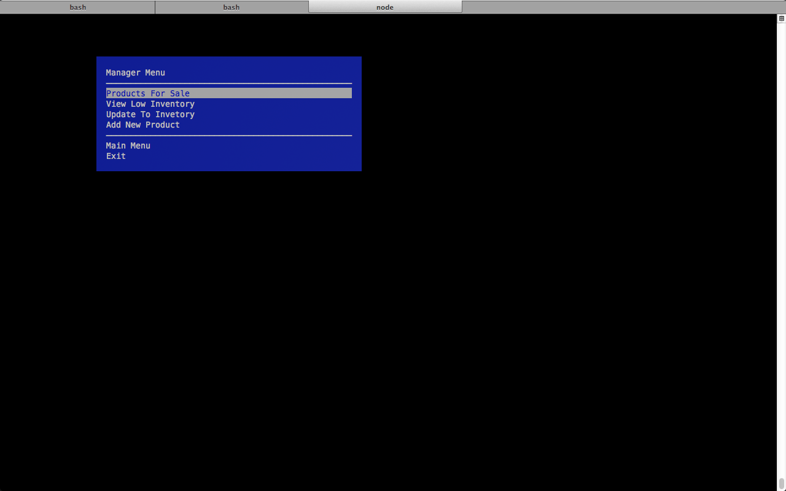
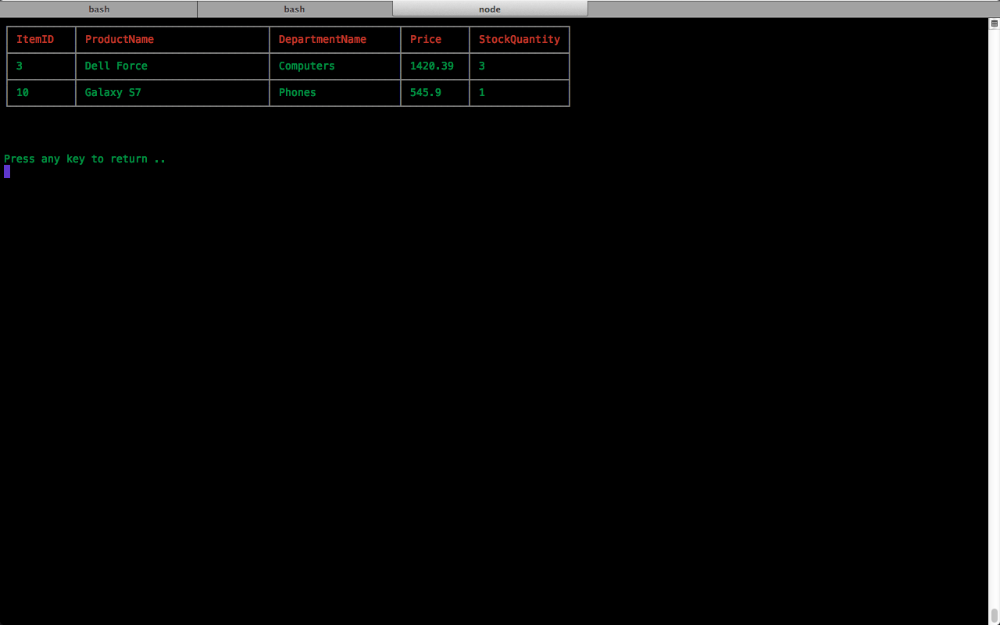
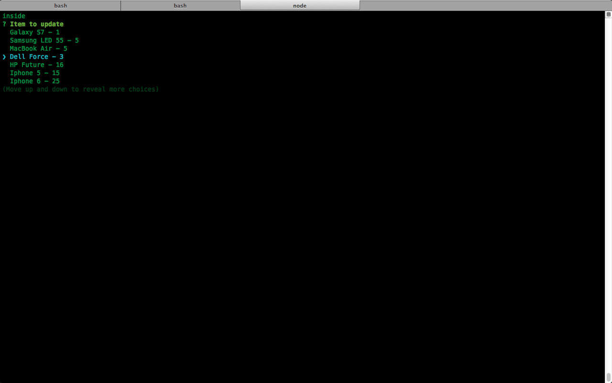
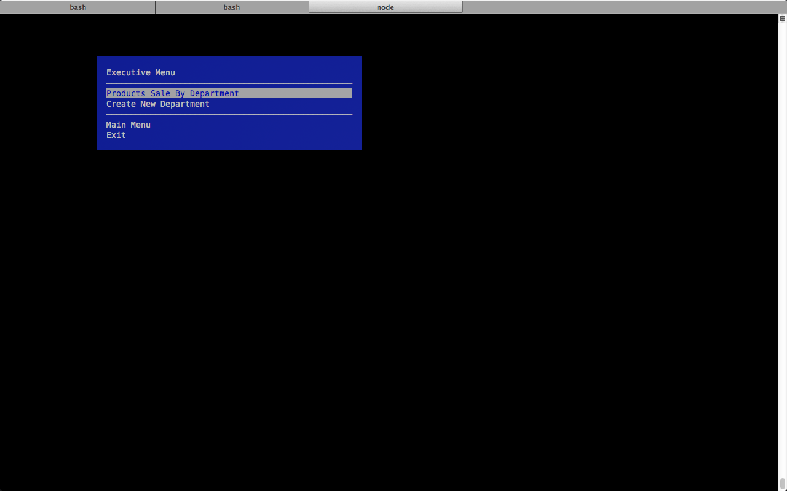

# Amazonode
DMS Application written in node.js
This is a menu driven application, all options can be selected using arrow keys
below are the implemented functionality

Some functionality are shown below:

1. Main Menu
    + Main Menu screenshot

    + 

    + Placing an Order

	+ 

    + List All Items

	+ 	

2. Manager Menu
    + Manager Menu screenshot

    + 

    + Low Inventory

	+ 	

    + Update Item

	+ 	

3. Executive Menu
    + Executive Menu screenshot

    + 
